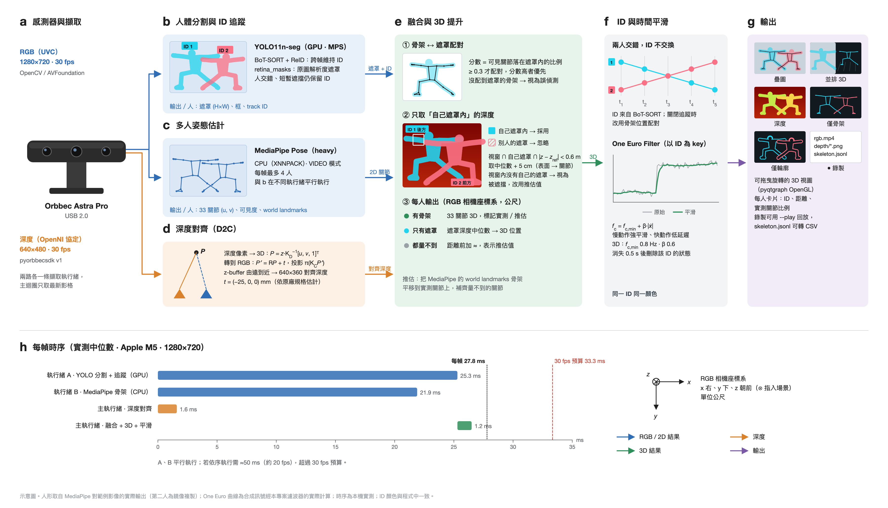

# Astra Multi-Person Skeleton

用 **Orbbec Astra Pro** RGB-D 相機做**多人 3D 骨架追蹤**：
YOLO11 人體分割 + BoT-SORT 追蹤 ID + RTMPose 逐人骨架，再以深度相機把每個關節換算成公制 3D 座標，
附原生桌面介面（Astra Studio）、錄製與回放。



## 功能

- **多人 3D 骨架**：每人 26 個關節（Halpe26，含腳趾、腳跟）的公制 3D 座標（公尺），標明每個關節是深度實測還是推估
- **由上而下逐人估計**：先用 YOLO 框出每個人，再對每個人各跑一次 RTMPose；骨架直接屬於該人的 ID，多人時不會互相跳動
- **人體分割與穩定 ID**：YOLO11 像素級遮罩 + BoT-SORT（ReID），人交錯或短暫遮擋仍保留同一 ID
- **遮罩內取深度**：關節深度只取自己遮罩內的值，前方的人或背景不會混進來；被擋住的關節改用推估
- **九項舞蹈動作指標**：每位舞者各自計算動作強度、左右平衡與協調、身體擴展、軌跡曲率、重心高度與晃動、出力程度、急動度
- **即時介面**：總覽頁（五種畫面模式、可旋轉 3D 視圖、指標表格）與指標頁（每人照片＋九項指標即時曲線）、即時調參
- **任何攝影機都能用**：介面可選攝影機；選 Astra Pro 為深度實測，選一般 webcam 時 3D 改由身體尺寸估計
- **WebSocket 串流與 headless 伺服器**：每幀推送 ID、距離、3D／2D 關節與輪廓；可不開視窗只當伺服器
- **錄製與回放**：RGB 影片 + 16-bit 深度 + 每幀 3D 骨架，可不接相機回放，骨架可轉 CSV
- **約 30 fps**：分割（GPU / MPS）與骨架（CoreML）平行推論，單人每幀約 25 ms、三人約 35 ms（Apple M5、1280×720）

## 需求

| 項目 | 說明 |
|---|---|
| 相機 | Orbbec Astra Pro（深度 PID 0x0403 + RGB「Astra Pro HD Camera」）；沒有 Astra 時任何 webcam 也能用（3D 為估計）|
| Python | **3.11**（pyorbbecsdk 1.3.2 在 macOS 只有 cp311 wheel，三個平台統一用 3.11）|
| 其他 | conda（Miniconda / Miniforge）、約 4–8 GB 磁碟空間（Linux / Windows 的 CUDA 版 PyTorch 較大）|

| 平台 | 驗證狀態 |
|---|---|
| macOS（Apple Silicon）| 接 Astra Pro 與 USB webcam 實測：介面、headless、串流、錄製 |
| Linux（Ubuntu 24.04，x86_64，RTX 5080）| 無攝影機：安裝、全部測試、headless 回放與 WebSocket 串流實測 |
| Windows（x86_64）| GitHub Actions 自動測試（無攝影機）；接 Astra 尚未實測 |

## 安裝

### macOS / Linux

```bash
git clone https://github.com/YukiHataRin/astra-multi-person-skeleton.git
cd astra-multi-person-skeleton

# 1. 在專案內建立 Python 3.11 環境
conda create -p ./.conda python=3.11 -y

# 2. 安裝套件
PYTHONNOUSERSITE=1 ./.conda/bin/python -m pip install -r requirements.txt

# 3. ultralytics 會另外裝 opencv-python，與 mediapipe 需要的 contrib 版衝突，只保留 contrib
./.conda/bin/python -m pip uninstall -y opencv-python
./.conda/bin/python -m pip install --force-reinstall --no-deps opencv-contrib-python==5.0.0.93

# 4. 安裝本專案（可編輯模式）
./.conda/bin/python -m pip install -e . --no-deps

# 5. 下載模型（YOLO11n-seg、RTMPose-m、MediaPipe Pose）與測試圖
./.conda/bin/python scripts/download_models.py
```

Linux 若是精簡安裝，可能缺 Qt 與 MediaPipe 需要的系統函式庫（錯誤訊息如 `libGLESv2.so.2: cannot open shared object file`）：

```bash
sudo apt install libegl1 libgl1 libgles2 libxkbcommon0 libfontconfig1 libdbus-1-3
```

### Windows（PowerShell）

```powershell
git clone https://github.com/YukiHataRin/astra-multi-person-skeleton.git
cd astra-multi-person-skeleton
conda create -p .\.conda python=3.11 -y
$env:PYTHONNOUSERSITE = "1"
.\.conda\python.exe -m pip install -r requirements.txt
.\.conda\python.exe -m pip uninstall -y opencv-python
.\.conda\python.exe -m pip install --force-reinstall --no-deps opencv-contrib-python==5.0.0.93
.\.conda\python.exe -m pip install -e . --no-deps
.\.conda\python.exe scripts\download_models.py
```

### NVIDIA GPU（Linux / Windows）

- **YOLO**：Linux 從 PyPI 裝的 PyTorch 已含 CUDA；Windows 的 PyPI 版只有 CPU，請另外安裝 CUDA 版
  （RTX 50 系列需要 CUDA 12.8 以上）：`pip install torch torchvision --index-url https://download.pytorch.org/whl/cu128`
- **RTMPose**（選用）：預設在 CPU 上執行即可（每人約 10 ms）；要用 GPU 時把 `onnxruntime` 換成 `onnxruntime-gpu`，`rtm_provider = "auto"` 會自動改用 CUDA

### Astra Pro 驅動

- **macOS**：不需要額外驅動
- **Linux**：一般使用者存取 USB 需要 Orbbec 的 udev 規則（需要 sudo 安裝一次），
  見 [pyorbbecsdk 說明](https://github.com/orbbec/pyorbbecsdk)；RGB 鏡頭需要使用者在 `video` 群組
- **Windows**：需安裝 Orbbec 的相機驅動（OpenNI2 協定裝置），見 [Orbbec 官網](https://www.orbbec.com/developers/)

## 啟動

接上 Astra Pro 後：

```bash
./.conda/bin/python -m astra_studio
```

或用啟動檔：macOS 在 Finder 雙擊 `launch.command`、Linux `./launch.sh`、Windows 雙擊 `launch.bat`
（Windows 指令列請把 `./.conda/bin/python` 換成 `.\.conda\python.exe`）。在右側「來源」選擇攝影機後按「**開始**」。

- 選 **Astra Pro HD Camera（RGB-D）**：深度實測的 3D 骨架
- 選**其他攝影機（僅 RGB）**：沒有深度，3D 由身體尺寸估計（見下方「沒有深度時」）
- 插拔攝影機後按「重新整理攝影機」

> **macOS 相機權限**：權限屬於「啟動程式的那個 App」。第一次執行時，請在「終端機」App
> （或你常用的終端機）中啟動並允許相機存取；也可在「系統設定 → 隱私權與安全性 → 相機」中開啟。
> 從背景程序或沒有權限的 App 啟動時，深度會正常但 RGB 打不開。

常用參數：

```bash
./.conda/bin/python -m astra_studio --start --view split   # 開啟即開始，並排顯示 3D
./.conda/bin/python -m astra_studio --no-seg               # 只跑骨架（不做分割）
./.conda/bin/python -m astra_studio --play recordings/20261006_112336   # 回放錄製，不需要相機
./.conda/bin/python -m astra_studio --list-cameras         # 列出相機
./.conda/bin/python -m astra_studio --camera "j5 WebCam JVCU100"   # 預選攝影機（名稱、裝置 ID 或編號）
./.conda/bin/python -m astra_studio --cv                   # OpenCV 簡易檢視器（開發用）
```

## 介面

| 區域 | 內容 |
|---|---|
| 上方 | RGB / 深度連線燈號、處理 fps |
| 主畫面 | **疊圖**：RGB + 遮罩 + 2D 骨架 + ID／距離<br>**並排 3D**：左疊圖、右 3D 視圖（左鍵拖曳旋轉、滾輪縮放）<br>**深度**：對齊後深度疊在 RGB 上，檢查對齊<br>**僅骨架**：黑底骨架<br>**僅輪廓**：黑底，只畫每人遮罩外框 |
| 指標表格 | 每位舞者一列：ID、距離、實測關節（指標用的 13 個）、九項指標；灰色表示指標來自推估骨架 |
| 指標分頁 | 左側每位舞者的照片（外框為代表色，已離開的變暗），右側九項指標最近 20 秒的曲線 |
| 右側設定 | 圖層開關、分割信心值、BoT-SORT 開關、骨架模型（RTMPose-m 或 MediaPipe）、平滑強度、遮罩取樣、對齊微調、各階段耗時 |
| 下方 | 狀態、**● 錄製**、截圖 |

- 實心關節點 = 深度實測，空心 = 推估
- 距離前有 **≈**（OpenCV 畫面為 `~`）表示這個人完全沒量到深度（太近 < 0.4 m、太遠或被遮擋），數值為推估
- ID 由 BoT-SORT 產生並持續遞增（例如 ID 54），只代表「同一個人」，不是人數

## 舞蹈動作指標

移植自 [Real-time Dance Aesthetics Analysis](https://github.com/YukiHataRin/realtime-dance-analysis)
（MIT License，Yeh, Lin, Jiang 2026，[DOI 10.5281/zenodo.22747639](https://doi.org/10.5281/zenodo.22747639)；授權全文見 `licenses/`），
改為**每位舞者各自計算**，並使用深度相機量到的公尺座標。指標是動作的**描述值**，例如「出力程度」是角加速度的代理指標，不是力感測器量到的力矩。

| 指標 | 單位 | 說明 |
|---|---|---|
| 動作強度 | rad²/s² | 肢體角速度平方的加權和，越大動作越激烈 |
| 左右平衡 | 0–1 | 左右兩側角速度大小的相似度，1 為完全平衡 |
| 左右協調 | −1–1 | 左右動作歷史的相關係數，1 為同步、−1 為交替 |
| 身體擴展 | m³ | 關節凸包體積，越大身體越舒展 |
| 軌跡曲率 | 1/m | 手腕、腳踝軌跡的平均曲率，越大動作越圓轉 |
| 重心高度 | m | 重心離地高度（需要深度量到腳踝才有值） |
| 重心晃動 | m | 重心偏離兩腳中點的水平距離 |
| 出力程度 | rad/s² | 肢體角加速度的加權和 |
| 急動度 | rad²/s⁶ | 角急動度平方的加權和，越低越流暢 |

- **只用 13 個關節**：鼻、雙肩、雙肘、雙腕、雙髖、雙膝、雙踝（再推算出骨盆、脊椎、胸、頸）。臉、手指、腳掌都不參與；
  表格的「實測關節」只計這 13 個，**全部沒量到深度時該列顯示為灰色**，表示指標來自推估骨架
- **與原專案的差異**：公尺單位（擴展度為 m³）、以實際時間戳計算導數、重心高度改為離地高度、曲率在速度過慢時不計、
  扁平骨架（沒有深度時所有關節在同一深度平面）的擴展度回報 0；其餘公式、肢體與質量權重與原專案相同
- 指標用平滑後的骨架計算；導數越高階越敏感，**急動度對抖動特別敏感**。人站得越遠、全身入鏡、深度量得越完整，數值越穩定
- 匯出：`tools/export_skeleton_csv.py` 會同時輸出 `metrics.csv`（每列一位舞者一幀）

> 展出時請避免讓**螢幕、海報上的人像**出現在相機畫面中：YOLO 無法區分螢幕裡的人與真人，也會為他們建立 ID 與指標。

## WebSocket 串流與 Headless 伺服器

### Headless（不開視窗的純伺服器）

```bash
./.conda/bin/python -m astra_studio --headless                          # 自動選 Astra Pro，ws://127.0.0.1:8765
./.conda/bin/python -m astra_studio --headless --camera "j5 WebCam JVCU100"
./.conda/bin/python -m astra_studio --headless --ws-host 0.0.0.0        # 開放區域網路其他裝置連線
./.conda/bin/python -m astra_studio --headless --record                 # 同時錄製
./.conda/bin/python -m astra_studio --headless --play recordings/<時間>   # 用錄影當來源，不需要相機
```

終端機每 5 秒印出 fps、人數、用戶端數；`Ctrl-C` 結束（`--duration 秒數` 可自動結束）。
headless 一樣需要相機權限：請從已允許相機的終端機啟動。

### 介面中串流

右側「串流（WebSocket）」勾選「啟用」，或啟動時加 `--ws`。會顯示位址與目前連線的用戶端數，開始／停止擷取時不會中斷。

### 用戶端範例

```bash
./.conda/bin/python tools/ws_client.py                  # 終端機印出每幀摘要
./.conda/bin/python tools/ws_client.py --json > s.jsonl # 存原始訊息
```

瀏覽器：用任何靜態伺服器開啟 `examples/web_viewer.html`（例如在 `examples/` 執行 `python3 -m http.server`，
再開 `http://127.0.0.1:8000/web_viewer.html`），會即時畫出輪廓、2D 骨架與俯視位置圖。

### 協定

JSON 文字訊息。連線後伺服器先送 `hello`，之後每幀送 `frame`（每個用戶端只保留一則待送的最新幀，傳送跟不上時跳過舊幀）。

```jsonc
// hello：連線時與來源切換時
{"type": "hello", "protocol": 1, "image": {"width": 1280, "height": 720},
 "metrics": [{"key": "energy", "name": "動作強度", "unit": "rad²/s²", "description": "..."}, ...],  // 指標定義
 "intrinsics": {"fx": 983.0, "fy": 984.0, "cx": 640.0, "cy": 360.0}, "has_depth": true,
 "formats": {"halpe26": {"names": ["nose", ...], "connections": [[0, 1], ...]}, "mediapipe33": {...}}}

// frame：每幀
{"type": "frame", "frame": 128, "t": 4.27, "fps": 30.1, "has_depth": true,
 "people": [{
   "id": 3,                          // BoT-SORT 追蹤 ID
   "distance": 2.14, "distance_measured": true,   // false 時為估計值（介面顯示 ≈）
   "centroid": [0.12, -0.05, 2.20],  // 遮罩深度換算的 3D 位置（公尺），沒有深度時為 null
   "format": "halpe26",
   "joints": [[x, y, z], ...],       // 3D 關節（公尺，RGB 相機座標系：x 右、y 下、z 前）
   "measured": [1, 1, 0, ...],       // 每個關節是否深度實測
   "pixels": [[u, v], ...], "visibility": [0.98, ...],   // 2D 關節與信心值
   "box": [x1, y1, x2, y2],
   "contour": [[[u, v], ...]],       // 遮罩外輪廓多邊形（像素），可能有多段
   "metrics": {"energy": 1.93, "sync_velocity": 0.58, ..., "height": null},  // 九項指標，資料不足時為 null
   "metric_joints_measured": 11      // 指標用的 13 個關節中實測幾個
 }]}
```

用戶端可送 `{"type": "ping"}`（回 `pong`）或 `{"type": "hello"}`（重送 hello）。
`[stream]` 設定可關閉輪廓或 2D 資料、調整推送上限與輪廓簡化程度。

> **安全性**：預設只綁 `127.0.0.1`。改成 `0.0.0.0` 後同一網路的任何裝置都能連線讀取資料，連線**沒有加密也沒有驗證**，請只在可信任的網路使用。

## 沒有深度時（一般攝影機）

一般攝影機量不到深度，3D 改用估計值（距離前標 **≈**，上方顯示「無深度 · 3D 估計」）：

- **距離**：針孔模型 `距離 ≈ 焦距 × 實際長度 ÷ 像素長度`，優先用軀幹長（肩中點到髖中點，成人平均 0.50 m，轉身時幾乎不變），看不到髖時改用肩寬（0.36 m）
- **關節**：2D 位置照用，深度取估計距離（RTMPose）；MediaPipe 模式則用它的 world landmarks 保留身體前後形狀
- **焦距**：一般攝影機沒有出廠校正，以 `[webcam] hfov_deg`（預設 70°）推算；換攝影機時可依規格調整

身體尺寸因人而異，估計誤差約 10–20%；**只拍到頭、看不到肩膀或髖時誤差會很大**。同樣的估計也用在 Astra Pro 距離太近（< 0.4 m）量不到深度時。

## 錄製與匯出

按「● 錄製」開始、再按一次停止，存到 `recordings/<時間>/`：

| 檔案 | 內容 |
|---|---|
| `rgb.mp4` | 原始 RGB（不含疊圖），可用 `--play` 重新跑整條管線 |
| `depth/*.png` | 16-bit 深度（mm，0 = 無效），與影片逐幀對應 |
| `skeleton.jsonl` | 每幀一行：每人 ID、距離（是否實測）、關節 3D 座標與是否實測、骨架格式、遮罩框 |
| `meta.json` | 錄製當下的相機內外參 |

右側「錄製」區取消「包含 RGB-D 影像」時只寫 `skeleton.jsonl`（檔案小很多，但無法回放）。

轉成 CSV（每列一個關節，可直接用 Excel / pandas 開）：

```bash
./.conda/bin/python tools/export_skeleton_csv.py recordings/<時間>
```

座標系：RGB 相機座標系，**x 向右、y 向下、z 朝前（離開相機）**，單位公尺。

## 設定

所有參數在 [`config/default.toml`](config/default.toml)，常調的有：

| 區段 | 參數 | 說明 |
|---|---|---|
| `[rgb]` `[depth]` | `fx` `fy` `cx` `cy` | 相機內參（目前依原廠 FOV 推算）|
| `[stream]` | `host` `port` `contours` `max_fps` | WebSocket 綁定位址、埠號、是否附輪廓、推送上限 |
| `[webcam]` | `hfov_deg` | 一般攝影機的水平視角（推算焦距用）|
| `[skeleton]` | `est_torso_m` `est_shoulder_m` | 沒有深度時估計距離用的身體尺寸 |
| `[extrinsics]` | `translation` | 深度 → RGB 相機的平移；可在介面「深度」模式下用滑桿微調後填回 |
| `[segmentation]` | `confidence` `tracking` | YOLO 信心值、是否啟用 BoT-SORT |
| `[pose]` | `backend` `num_poses` | `rtmpose`（逐人，多人穩定）或 `mediapipe`；最多估計骨架的人數 |
| `[pose]` | `rtm_provider` `pipelined` | RTMPose 用 CoreML 或 CPU；是否用上一幀人框與 YOLO 平行 |
| `[fusion]` | `use_mask` `point_cloud` | 遮罩內取深度、3D 點雲 |
| `[skeleton]` | `depth_gate` | 關節深度與人體基準深度差超過此值視為錯值 |
| `[smoothing]` | `min_cutoff_3d` `beta_3d` | One Euro 平滑：抖動就調小 `min_cutoff`，太黏就調大 `beta` |

## 演算法

每幀流程（詳見上方架構圖）：

1. **擷取**：RGB（UVC，1280×720）與深度（OpenNI，640×480）各一條執行緒，只取最新影格
2. **分割 ∥ 骨架**：YOLO11n-seg + BoT-SORT（GPU / MPS）找出每個人的遮罩、框與 ID；同時 RTMPose-m（CoreML）
   以**上一幀**的人框逐人估計 26 點骨架（30 fps 下人只移動幾個像素，框已放大 1.25 倍），兩者平行執行
3. **深度對齊**：以內外參把深度圖投影到 RGB 視角（軟體 D2C）
4. **融合**：骨架依 track ID 對到這一幀的遮罩；關節深度只取自己遮罩內、且與人體基準深度差 < 0.6 m 的值，取中位數 + 5 cm（表面 → 關節中心）
5. **補值**：量不到深度的關節，2D 位置照用、深度取這個人實測關節的中位數；只有遮罩沒有骨架的人，以遮罩深度中位數給出 3D 位置
6. **平滑**：以 track ID 為 key 的 One Euro Filter

## 專案結構

```
├── config/            default.toml（所有參數）、botsort_reid.yaml
├── src/astra_studio/
│   ├── core/          純演算法（不依賴 Qt / torch / mediapipe）：對齊、融合、3D 提升、平滑、舞蹈指標
│   ├── sensors/       Astra Pro 擷取、一般攝影機、錄製回放、相機列舉
│   ├── perception/    YOLO11 分割 + BoT-SORT、RTMPose 逐人骨架、MediaPipe Pose、推論裝置選擇
│   ├── pipeline/      單幀流程、擷取迴圈 runner（不依賴 Qt）、Qt 背景 worker
│   ├── render/        2D 疊圖、3D 場景資料、ID 色票
│   ├── io/            錄製、WebSocket 串流伺服器
│   ├── ui/            PySide6 介面（主視窗、3D 視圖、人物卡片、設定面板）
│   └── apps/          headless 伺服器、OpenCV 簡易檢視器
├── tests/             core / dance_metrics / perception / ui / io / stream 測試
├── licenses/          第三方授權（Real-time Dance Aesthetics Analysis，MIT）
├── tools/             ws_client.py、export_skeleton_csv.py、preview.py、make_architecture_figure.py
├── examples/          web_viewer.html（瀏覽器即時檢視串流）
├── scripts/           download_models.py（跨平台模型下載）
└── docs/              PLAN.md（整合規劃）、figures/（架構圖）
```

## 測試

```bash
PYTHONNOUSERSITE=1 ./.conda/bin/python -m unittest discover -s tests -v
```

不需要相機。`test_core` / `test_ui` / `test_io` / `test_stream` 用合成資料（`test_stream` 含真實 WebSocket 連線與 headless 指令）；`test_perception` 用範例圖跑真實模型
（需先執行 `scripts/download_models.py`，否則自動略過），並包含 GPU 記憶體不成長的回歸測試。

## 已知限制

- **對齊是估計值**：Astra Pro 的硬體深度對齊在 macOS 上會卡住，SDK 也讀不到出廠校正，內外參依原廠 FOV 推算，3D 位置可能有數公分誤差。可在「深度」模式用「對齊 x 平移」微調。
- **深度有效範圍約 0.4–6 m**：太近或太遠時整個人改用身體尺寸估計（距離前標 ≈）。要量到全身，請站在相機前約 1–3 m。
- **MacBook 螢幕蓋上時內建相機無法使用**：macOS 仍會列出它，選了會在 6 秒後顯示「沒有送出影像」，請改接 USB 攝影機。
- **新出現的人晚一幀才有骨架**：RTMPose 用上一幀的人框才能與 YOLO 平行；設 `[pose] pipelined = false` 可改為同一幀（三人時約 45 ms／幀）。
- **RTMPose 的 CoreML 不能改變 batch 大小**，因此每人各跑一次（約 4 ms／人）；CoreML 出錯時自動改用 CPU（約 10 ms／人）。
- **MediaPipe 模式固定用 CPU**：macOS 上 mediapipe 的 GPU delegate 每幀洩漏約 14 MB Metal 記憶體（0.10.35 與 1.0.1 皆然），30 fps 下不到一分鐘耗盡；1.0.1 的 CPU delegate 又會崩潰，因此固定 0.10.35 + CPU。
- **ONNX Runtime 的遙測已關閉**：onnxruntime 1.21+ 預設會傳使用資料給 Microsoft，且其上傳執行緒會讓程式結束時偶爾 abort（exit 134）；本專案匯入時即設定 `ORT_DISABLE_TELEMETRY=1`。
- **MediaPipe 0.10.35 的使用資料回傳**（只在選用 MediaPipe 骨架時；預設的 RTMPose 模式不會載入 mediapipe）：此版本會嘗試連線 `play.googleapis.com`（log 中可見 `portable_clearcut_uploader`），官方未提供關閉方式（[google-ai-edge/mediapipe#6291](https://github.com/google-ai-edge/mediapipe/issues/6291)）。介意者可用防火牆（如 LuLu、Little Snitch）阻擋。
- **Astra Pro 的 RGB 與深度不同步**：兩者是獨立裝置，快速動作時可能有一兩幀時間差。

## 版本與更新

- `main` 分支永遠是最新的穩定版；每個版本都有 git tag（`v0.1.0`、`v0.2.0`…），內容見 [CHANGELOG](CHANGELOG.md)
- 切換到指定版本，或回到最新版：

  ```bash
  git fetch --tags
  git checkout v0.4.0      # 切到 0.4.0（之後要重跑 pip install -e . --no-deps 讓版本號更新）
  git checkout main        # 回到最新版
  git pull
  ```

- 也可以在 GitHub 的 [Releases](https://github.com/YukiHataRin/astra-multi-person-skeleton/releases) 下載各版本的原始碼壓縮檔
- `python -m astra_studio --version` 顯示目前版本
- 開發新功能用獨立分支，GitHub Actions 在三個平台測試通過後再合併回 `main`
- 所有平台用同一份程式碼，平台差異（攝影機後端、推論後端、字型）在程式中自動判斷，**不需要**為不同系統切換分支

## 致謝

- [Orbbec pyorbbecsdk](https://github.com/orbbec/pyorbbecsdk)：Astra Pro 深度擷取（v1，支援 OpenNI 協定裝置）
- [RTMPose / MMPose](https://github.com/open-mmlab/mmpose/tree/main/projects/rtmpose)：Halpe26 逐人骨架模型（Apache-2.0）；前後處理參考 [rtmlib](https://github.com/Tau-J/rtmlib)
- [MediaPipe](https://github.com/google-ai-edge/mediapipe)：Pose Landmarker（替代骨架後端）
- [Ultralytics](https://github.com/ultralytics/ultralytics)：YOLO11 實例分割與追蹤整合
- [BoT-SORT](https://github.com/NirAharon/BoT-SORT)：多目標追蹤與 ReID
- [PySide6](https://doc.qt.io/qtforpython-6/)、[qt-material](https://github.com/UN-GCPDS/qt-material)、[pyqtgraph](https://github.com/pyqtgraph/pyqtgraph)：介面與 3D 視圖
- [Real-time Dance Aesthetics Analysis](https://github.com/YukiHataRin/realtime-dance-analysis)：九項舞蹈動作指標（MIT License）
- [websockets](https://github.com/python-websockets/websockets)：WebSocket 串流伺服器（BSD-3-Clause）
- [Human Mask Studio](https://github.com/YukiHataRin/human_semantic_segmentation)：分割引擎、相機列舉與介面風格的來源
- One Euro Filter：Casiez, Roussel & Vogel, *1€ Filter: A Simple Speed-based Low-pass Filter for Noisy Input in Interactive Systems*, CHI 2012

## 授權

[AGPL-3.0](LICENSE)。本專案使用的 Ultralytics YOLO 以 AGPL-3.0 授權；RTMPose、MediaPipe、pyorbbecsdk 為 Apache-2.0；舞蹈指標移植自 MIT 授權的 Real-time Dance Aesthetics Analysis（授權全文見 `licenses/`）。
